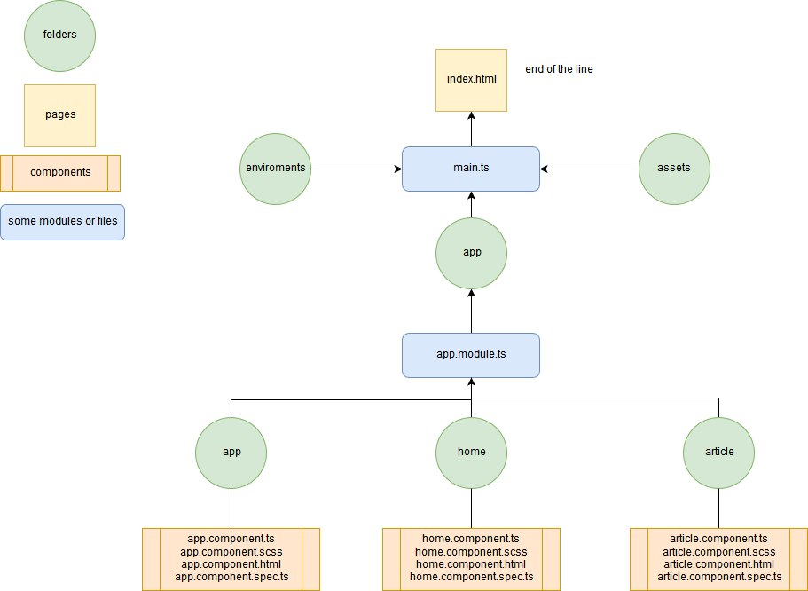

# Angular project



#### Component`(src / app / home )`
```ts
/* Импорт:
  * Декоратор Component (@Component) - используеться для описания компонента. Связывает styles, model(ts), view(html) вместе
  * OnInit (Interface) - Lifecycle hook Инициализируется когда все установлено
*/
import { Component, OnInit } from '@angular/core';

// Декоратор в действии
@Component({
    selector: 'app-home',                   // таким селектором вызываеться на view этот компонент
    templateUrl: './home.component.html',   // path to view
    styleUrls: ['./home.component.scss']    // path to styles
})

// Класс соотвественно model(ts) осущетсвляем интерфейс OnInit
export class HomeComponent implements OnInit {

    constructor() { }

    ngOnInit() {
    }

}
```

#### Module `src / app / app.module.ts`

```ts
/* BrowserModule - Настраивает приложение на основе браузера для перехода с приложения,
                   созданного сервером, если оно присутствует на странице.
                   Указанные параметры должны содержать идентификатор приложения,
                   который должен совпадать между клиентскими и серверными приложениями.
*/
import { BrowserModule } from '@angular/platform-browser';
import { NgModule }      from '@angular/core';             // (Декоратор) нужен для обозначения какие директивы будут использоваться, что импорититься и так далее
import { FormsModule }   from '@angular/forms';            // Класс для того чтобы юзать  [(ngModel)]="..."


// Components
import { AppComponent }     from './app/app.component';            // Этот компонент отобразиться первым так как он в bootstrap
import { HomeComponent }    from './home/home.component';
import { ArticleComponent } from './article/article.component';


@NgModule({

  // Здесь обозначаем какие директивы (компоненты, пайпы) будут использоваться
  declarations: [
    AppComponent,
    HomeComponent,
    ArticleComponent
  ],

  // Задает список модулей, экспортные директивы / каналы которых должны быть доступны для шаблонов в этом модуле. Это может также содержать ModuleWithProviders.
  imports: [
    BrowserModule,
    FormsModule
    // BrowserAnimationsModule,
    // MaterialModule,

  ],

  // Задает список директив / труб / модулей, которые могут использоваться в шаблоне любого компонента, который является частью модуля Angular, который импортирует этот модуль с угловым модулем.
  exports: [],

  // Определяет набор инъекционных объектов, доступных в инжекторе этого модуля.
  providers: [],

  // Определяет компоненты, которые должны быть загружены, когда этот модуль загружается. Компоненты, перечисленные здесь, будут автоматически добавлены в entryComponents.
  // выходит что это тот комопнент который мы увидим на странице
  bootstrap: [AppComponent]
})
export class AppModule { }
```